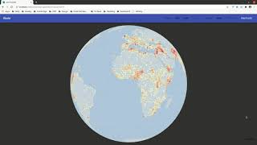
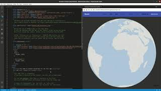
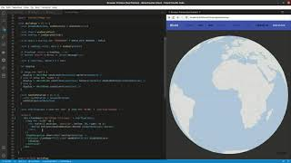
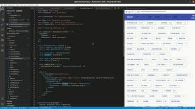
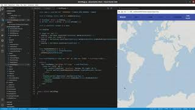

# Demo of GeoTracker Client

## Technology

Primary technology used to build this project is

- React
- Apollo GraphQL Client
- D3

## Videos

The following videos explain how the project is built

01 Overview of UX

02 Layout of React App

03 Page level GraphQL data

04 Components, styling and CSS

05 Map making with D3

## Backend

The partner backend project can be found at

https://github.com/daniel-payne/demotracker-server

## Available Scripts

This project was bootstrapped with [Create React App](https://github.com/facebook/create-react-app).

`npm start`
`npm build`
